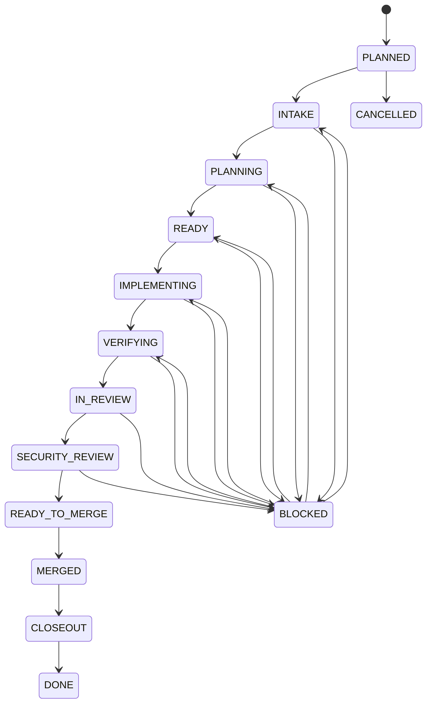

# Estados da tarefa

## Objetivo

Os estados tornam o andamento legível para humanos e agentes. O estado deve representar **o que é verdade agora**, não o que se pretende fazer depois.

## Fluxo padrão



O projeto pode pular fases **somente quando elas forem explicitamente não aplicáveis**, nunca por conveniência silenciosa.

## Estados

### `PLANNED`

A tarefa existe e foi priorizada, mas ainda não teve intake completo.

Entrada mínima:
- objetivo preliminar conhecido.

Saída:
- iniciar levantamento de estado e contratos.

### `INTAKE`

O Codex está recuperando o estado fresco e validando escopo, dependências e contexto necessário.

Saída somente quando:
- fonte de verdade foi consultada;
- dependências foram classificadas;
- referências relevantes foram identificadas.

### `PLANNING`

A solução está sendo desenhada antes de modificar código.

Saída somente quando `PLAN.md` contém estratégia suficiente para executar e verificar a tarefa.

### `READY`

Plano aceito e dependências suficientes estão disponíveis. A tarefa pode ser implementada.

### `IMPLEMENTING`

Código, configuração ou documentação de produto está sendo alterado conforme o plano.

Não usar este estado durante reconhecimento inicial ou revisão.

### `VERIFYING`

A implementação terminou e está sendo validada com testes, lint, build, migrações, smoke tests ou outros gates definidos.

Falha causada pelo diff retorna a `IMPLEMENTING` após diagnóstico.

### `IN_REVIEW`

A entrega está sob revisão crítica. Findings efetivos devem ser registrados em `REVIEW.md` ou na thread do PR.

Finding que exige correção normalmente devolve a tarefa para `IMPLEMENTING` e depois `VERIFYING`.

### `SECURITY_REVIEW`

A superfície alterada está sendo avaliada quanto a riscos de segurança. Para tarefas sem superfície de segurança relevante, registrar `N/A` com justificativa e avançar.

### `READY_TO_MERGE`

Critérios técnicos e de revisão foram satisfeitos; falta apenas o gate de integração/merge previsto.

### `MERGED`

A implementação foi integrada à branch alvo. `MERGED` ainda não é `DONE`: evidências e registros finais podem estar pendentes.

### `CLOSEOUT`

Atualização final de `EVIDENCE.md`, `STATUS.md`, `BOARD.md`, merge SHA, decisões permanentes e pendências formalizadas.

### `DONE`

A tarefa está encerrada e auditável.

Não reabrir silenciosamente. Trabalho adicional deve gerar nova tarefa ou reabertura explicitamente registrada.

## Estados excepcionais

### `BLOCKED`

A tarefa não pode prosseguir corretamente devido a dependência real.

Obrigatório:

```text
BLOCKED_BY=<referência objetiva>
```

Também registrar:
- último estado produtivo;
- condição necessária para desbloqueio;
- evidência do bloqueio.

Quando desbloqueada, retomar no estado apropriado; não necessariamente em `INTAKE`.

### `CANCELLED`

A tarefa foi encerrada sem conclusão por decisão explícita. Registrar motivo e impacto.

## `DEFERRED_GATE` não é estado

`DEFERRED_GATE` é uma **classificação de gate**, não uma fase da tarefa.

Uma tarefa pode, por exemplo, estar em `VERIFYING` com:

```text
DEFERRED_GATE=ci/global-tests run 12345 — falha preexistente confirmada
```

A política do projeto determina se esse adiamento permite avançar. Nunca classifique como adiado algo causado pelo próprio diff.

## STATUS.md mínimo

```markdown
# Status

TASK: ABC-001
STATE: IMPLEMENTING
BRANCH: task/ABC-001-exemplo
HEAD: <sha>
PR: pending
BLOCKED_BY: none
DEFERRED_GATE: none

## Próximo gate

<descrição objetiva>

## Última atualização

<AAAA-MM-DD + resumo curto>
```
